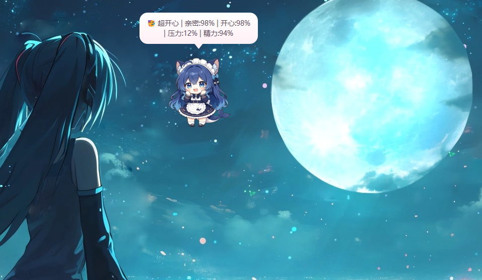
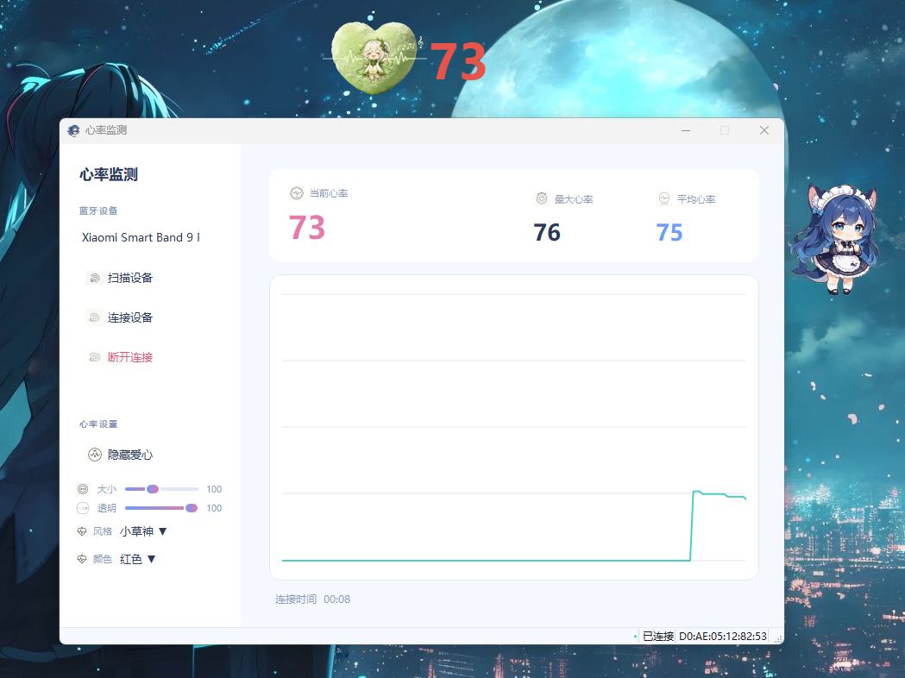

# BoringPet 桌面宠物

一只住在桌面上的 AI 小宠物：**AI 对话 + 记忆系统 + 情绪系统 + 游戏陪伴评论 + 算命占卜 + 心率监测 + 录屏 + 音乐播放**。


 

## ✨ 功能亮点

| 功能 | 说明 |
|---|---|
| 🗣️ AI 对话 | 直连 DeepSeek/DSH，微信式短句聊天，支持看图 |
| 🧠 记忆系统 | 对话向量化语义检索 + 重要记忆 + 事实画像 + 承诺，越聊越懂你 |
| ❤️ 情绪系统 | 激素驱动（催产素/多巴胺/皮质醇）+ 亲密值/开心值/精力值，会想你、会失落 |
| 🎮 游戏陪伴 | 你打游戏时它会看屏幕吐槽/鼓励，随机间隔主动说话 |
| 🔮 算命占卜 | 塔罗/六爻/小六壬/八字，SQLite 记录 + 应验追踪 |
| 💓 心率监测 | 连接小米手环等蓝牙设备，实时心率 + 关心提醒 |
| 📹 录屏 | 心率超标自动录屏（含系统声音） |
| 🎵 音乐播放 | 本地音乐 + 歌词窗口 |

**⬇️ 下载打包版（Windows）**：[Releases 页面](https://github.com/Dyyjdx/BoringPet/releases) → 下载 `BoringPet.zip`，解压即用（无需装 Python）。

**技术栈**：Python 3.12 / PySide6（GUI）/ pygame（音频）/ bleak（蓝牙）/ 云端 embedding API（记忆检索）/ SQLite（算命记录）
**运行**：`python main.py`（或双击 `b-pet.bat`，入口 `main.py`）

## 快速开始（给新用户）

```bash
# 1. 装依赖（不需要 torch/transformers）
pip install -r requirements.txt

# 2. 生成自己的配置文件（settings.json 含 API Key，已被 git 忽略，不会提交）
copy settings.example.json settings.json
# 然后编辑 settings.json，填入你的 API Key：
#   - chat.api_key / active.api_key：DeepSeek（对话、看图、评论）
#   - vector.api_key：阿里百炼（记忆语义检索，可选，不填会降级为最近几条）

# 3. 启动
python main.py
```

> 注意：`assets/`（宠物动画帧）、`音乐/`、`recordings/` 等大体积/隐私目录**不随仓库分发**，
> 启动后桌宠没有动画素材是正常的，按需自行补充即可。

---

## 目录结构

```
├── main.py                 # 启动入口(打开主窗口, 可选的 torch 预加载)
├── chat_window.py          # AI 对话窗口(唯一在根目录的界面模块, 含记忆工具调用)
├── b-pet.bat               # 一键启动(源码/dev, 普通权限)
├── b-pet-admin.bat         # 管理员权限启动(只有「游戏优化」需要)
├── build_exe.bat           # 一键打包成 exe(产物在 dist\BoringPet\)
├── BoringPet.spec          # PyInstaller 打包配置
├── 打包说明.md              # 怎么打包分发给别人(含踩坑记录)
├── docs/代码问题清单.md      # 代码审查发现的问题清单
├── settings.json           # 所有可调设置(模型/间隔/人设), 由设置窗口写入
├── config.json             # 动画帧率等底层配置
├── chat_state.json         # 当前会话的对话历史(记忆系统的原始输入)
├── requirements.txt        # Python 依赖(注意: 不需要 torch/transformers)
├── README.md               # 本文件
├── assets/                 # 宠物动画素材
├── 图标/ 心率图标/ 音乐/ 音乐素材/  # 各类资源
├── recordings/             # 录屏输出
├── memory/                 # 所有数据文件(记忆/情绪/用量/算命库), 见下方表格
├── src/                    # 全部功能模块(见功能索引)
└── (其余为构建产物/第三方源码/历史调试残留, 可清理)
```

---

## 功能索引（找代码用 ★核心）

| 功能 | 所在文件 | 关键入口 | 相关配置/数据 |
|---|---|---|---|
| **AI 对话**（聊天窗口） | `chat_window.py` | `ChatWindow.send()` L676；`ChatWorker.run()` L317（发送/流式/工具轮）；`_build_system_prompt()` L79（人设骨架）；`VisionWorker` L469（截图识别） | settings.json `chat` 段；chat_state.json |
| **记忆工具**（模型按需调） | `chat_window.py` | `MEMORY_TOOLS` L217；`_run_memory_tool()` L287；`_detect_recall()` L281 | memory/memories.json |
| **主动评论**（平时/游戏/双击） | `src/pet.py` + `src/active_chat.py` | pet.py：`_idle_comment_check` L1096（想念触发）、`_game_watch_check` L1078（游戏截图）、`contextMenuEvent` L519（右键菜单/双击入口）；active_chat.py：`ActiveChatWorker` L319、`GameWatchWorker` L364、`ScreenshotCommentWorker` L424、`_sf_chat` L208（API 调用）、`_build_persona` L57（主动评论人设） | settings.json `intervals`（评论频率）、`chat`（模型） |
| **记忆系统**（核心） | `src/memory.py` | `add_memory()` L425；`_get_embedding()` L301（云端 API）；`build_memory_prompt()`；`tick_hormones()` L150（情绪衰减）；`on_user_spoke()` L216（激素变化）；`on_pet_clicked()` L236；衰减清理（启动时） | memory/ 全部文件 |
| **算命占卜**（塔罗/六爻/小六壬/八字） | `src/divination.py` + `src/divination_ui.py` | `run_divination()` L391；`parse_command()` L490（/卦 命令）；`review_pending()` L433（应验提醒）；`recent_records()` L477；`_ds_chat()` L108（DeepSeek 解读） | memory/divination.db |
| **心率监测**（BLE 蓝牙） | `src/heart.py` | `HeartManager.start_scan()` L257；`connect_device()` L265；`HeartFloat` L334（桌面心跳悬浮窗）；`HeartWindow` L563 | 心率图标/ |
| **录屏**（含系统声音） | `src/screen_recorder.py` | `ScreenRecorder` L34；`get_recorder()` L226（单例） | recordings/ |
| **音乐播放** | `src/music_player.py` + `src/lyric_window.py` | `MusicPlayer` L29（pygame 混音）；歌词窗口独立实现 | 音乐/、音乐素材/ |
| **Token 用量统计** | `src/token_stats.py` + `src/usage_window.py` | `record_usage()` L129（各模型独立计费）；`estimate_tokens()` L118；`load_usage()` L100 | memory/usage.json |
| **设置窗口** | `src/settings_window.py` | `SettingsWindow` L230；`load_settings()` L177；`save_settings()` L196；`DEFAULT_SETTINGS` L88（默认值总表） | settings.json |
| **游戏优化**（MeoBoost 风格） | `src/game_boost.py` | 各 `_*_apply()`/`_*_restore()`（Nagle/MMCSS/注册表项），右键菜单调用 | Windows 注册表 |
| **DSH 接入**（备用对话通道） | `src/dsh_chat.py` + `src/dsh_client.py` | `DshChatWorker` L124；`pet_persona()` L92 | .dsh_sdk/ |
| **音效** | `src/sounds.py` | 播放各类音效 | 音乐素材/ |
| **动画帧** | `src/frames.py` | 宠物动作帧调度 | assets/、config.json |
| **路径/配置基础** | `src/paths.py`、`src/config.py` | 全局路径与配置读取 | — |
| **主窗口**（宠物本体/气泡/录屏按钮） | `src/pet.py` | `PetWindow` L196；`BubbleWidget` L42；`_show_bubble()` L1217 | — |

---

## 数据文件说明（memory/）

| 文件 | 内容 | 备注 |
|---|---|---|
| `memories.json` | 对话向量记忆：每条含文本+1024 维向量+时间+批次 | 记忆检索主库，体积大（几百 KB） |
| `important.json` | 重要记忆（里程碑事件） | 上限 20 条 |
| `facts.json` | 主人长期画像/偏好事实 | 上限 50 条，冲突时覆盖不堆叠 |
| `promises.json` | 桌宠对主人的承诺 | 每次对话注入提示词 |
| `diary/` | 每日小日记 | 低频自动写 |
| `raw_history.json` | 逐字对话归档（append-only） | 记忆原始素材 |
| `char_state.json` | 情绪/激素状态：oxytocin/dopamine/cortisol/longing/energy | `tick_hormones` 驱动 |
| `user_state.json` | 主人侧状态 | — |
| `divination.db` | 算命记录（SQLite：流派/问题/解读/状态/应验反馈） | `divination.py` 读写 |
| `usage.json` | token 用量与花费（分模型计费） | `token_stats.py` 读写 |

---

## 常用改动速查（改哪里）

- **改人设/语气** → 对话：`chat_window.py` `_build_system_prompt()`；主动评论：`active_chat.py` `_build_persona()`；设置里还有一份可覆盖的 persona（设置窗口 → 宠物设置）
- **改评论频率/想念阈值** → `settings.json` `intervals` 段（game_comment_min/max_minutes、idle_longing_threshold 等）
- **换模型** → `settings.json` `chat` 段（provider / base_url / model / api_key）
- **改记忆/情绪逻辑** → `src/memory.py`（情绪衰减在 `tick_hormones` 的 decay 系数，激素变化在 `on_user_spoke`）
- **改记忆提取频率** → `src/memory.py` 提取触发逻辑（每 N 次/新聊/退出）
- **改窗口/气泡样式** → `src/pet.py`（BubbleWidget、_show_bubble）

---

## 已知注意事项

- **不需要 torch / transformers**：向量检索已改成调云端 embedding API（见 `src/memory.py`）。
  `main.py` 里 `import torch` 只是「本机装了就先加载」的可选行为（避免 c10.dll 冲突）。
  装上 torch 只会让打包体积从几百 MB 涨到几 GB，别人不需要装。
- 云端向量 API 未配置 key 或调用失败时，检索自动降级为「最近几条」，功能不受影响
- 聊天历史发送时裁剪为 system + 最近 39 条（`chat_window.py` 的 MAX_HISTORY=40），界面与存档保持完整
- 记忆/情绪文件读写均受 `_IO_LOCK`（RLock）保护，多线程安全。
  注意**全项目统一用 `import memory`**，不要写成 `from src import memory` ——
  那样会加载出第二份模块实例，两把锁各管各的，等于没有保护
- 打包分发请看 [打包说明.md](打包说明.md)；代码审查发现的问题见 [docs/代码问题清单.md](docs/代码问题清单.md)
- ⚠️ **`settings.json` 里有 API Key，绝不打包/分享出去**。`.gitignore` 已忽略它，
  `build_exe.bat` 也会强制删除误打包的副本
